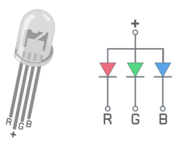
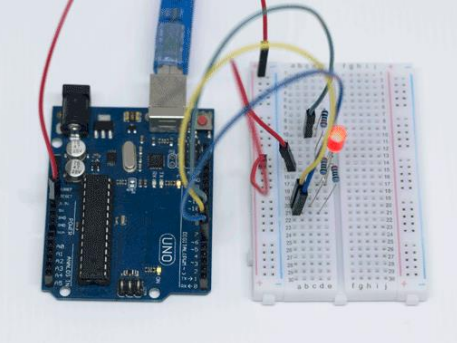
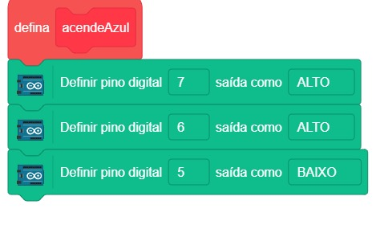
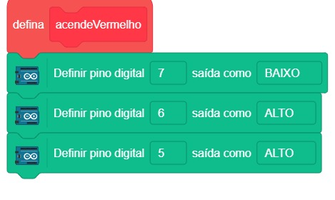
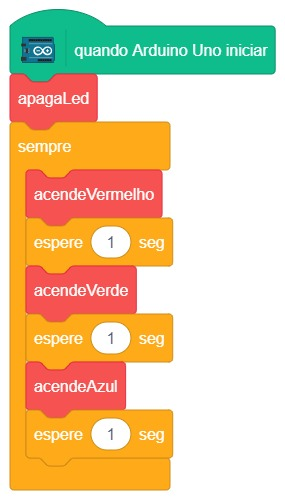

# Luzes Coloridas

  

Alguns LEDs são capazes de mudar a sua cor, chamamos eles de LED RGB. Ele tem o mesmo funcionamento básico de um LED comum porém possui três cores no mesmo componente, como se fossem três LEDs juntos: Red(R), Green(G) e Blue(B). Assim podemos trocar as cores via programação e até mesmo fazer misturas.

Como mostrado na figura abaixo, o LED RGB possui quatro pernas, sendo a perna maior o pino positivo comum
para todos os LEDs internos.

## Material Necessário

- 1x LED RGB 5mm
- 3x Resistor 220 ohm
- 5x Jumper Macho-macho
- 1x Cabo USB
- 1x Placa Uno

## Montagem do circuito

A montagem deste circuito é feita como se fossem três LEDs colocados no mesmo projeto. Adicione um resistor para cada perna de cor do LED RGB e conecte o pino 5 V do Arduino à perna positiva do LED RGB. Cada pino de cor do LED é conectado a uma porta digital do Arduino.

Importante! Note que o fio vermelho 5V deve ser conectado à perna mais comprida do LED.

## Programação

O programa consiste em alternar cada uma das cores do LED em um intervalo de 1 segundo.

### Para PictoBlox

A programação de blocos pode ser vista na figura a baixo.

Não esqueça de criar os métodos antes de programar a função principal.

### Para ArduinoIDE

O código para programação na interface ArdunoIDE pode ser encontrado [aqui](ArduinoIDE/ArduinoIDE.cpp).

## Possíveis erros

Caso o projeto não funcione verifique alguns dos possíveis erros:

- Verifique se os jumpers estão na mesma coluna dos terminais dos componentes, fazendo assim a conexão;
- Verifique se os jumpers estão ligados nos pinos corretos no Arduino;
- Verifique se o terminal positivo do LED RGB está na posição correta ligado ao 5V do Arduino;

## Desafios

Veja abaixo alguns desafios que você pode tentar!

- Faça uma mistura de cores acionando duas cores ao mesmo tempo;
- Utilize os conceitos que aprendemos no projeto anterior para trocar as cores do LED ao apertar um botão;
- Se feito na IDE do Arduino: Faça o controle do brilho de cada uma das cores utilizando os conceitos aprendidos no Projeto 3 e a função `analogWrite()` no lugar de `digitalWrite()`.
- Se feito no Pictoblox: Faça o controle do brilho de cada uma das cores utilizando os conceitos aprendidos no Projeto 3 e o bloco `Definir Pino PWN` no lugar do bloco `Definir pino digital`.
