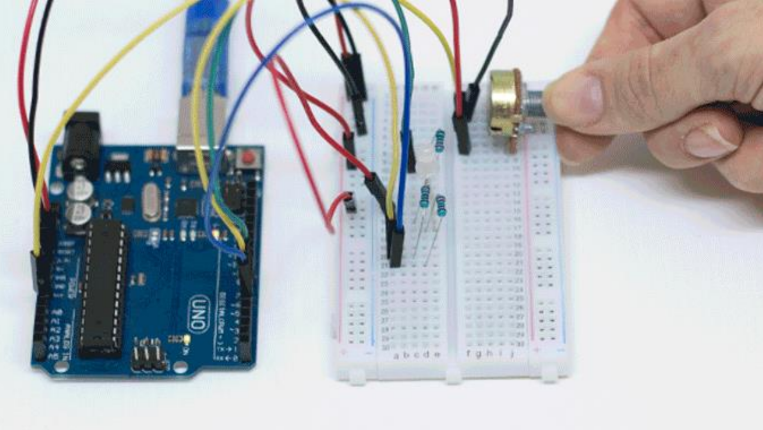

# Troque a cor das luzes

  

No projeto anterior, fizemos um LED RGB piscar sem parar com cores diferentes. Neste projeto você que irá comandar como o LED irá variar a sua cor. Para dar os comandos para a placa Arduino, iremos utilizar um potenciômetro. O projeto 7 consiste em controlar as cores do LED RGB ao rotacionar o potenciômetro.

## Material Necessário

- 1x LED RGB 5mm
- 1x Potenciômetro 10K ohm
- 3x Resistor 220 ohm
- 1x Protoboard
- 9x Jumper Macho-macho
- 1x Cabo USB
- 1x Placa Uno

## Montagem do circuito

A montagem do LED RGB é a mesma do projeto anterior. Adicione o potenciômetro ligando um pino em 5V, outro em GND e seu pino central em uma porta analógica do Arduino. Não se preocupe com o lado, assim como um resistor comum, o potenciômetro não tem lado positivo ou negativo, ou seja, tanto faz o lado que é conectado ao circuito. O único cuidado que se deve ter ao colocar o potenciômetro na protoboard é o encaixe, que tem que apertar um pouco.

Importante! Note que o fio vermelho 5V deve ser conectado à perna mais comprida do LED.

## Programação

### Para PictoBlox

A programação de blocos pode ser vista na figura a baixo.

Não esqueça de criar os métodos antes de programar a função principal.

### Para ArduinoIDE

O código para programação na interface ArdunoIDE pode ser encontrado [aqui](ArduinoIDE/ArduinoIDE.cpp).

## Possíveis erros

Caso o projeto não funcione verifique alguns dos possíveis erros:

- Verifique se os jumpers estão na mesma coluna dos terminais dos componentes, fazendo assim a
  conexão;
- Verifique se os jumpers estão ligados nos pinos corretos no Arduino;
- Verifique se o terminal positivo do LED RGB está na posição correta, ligado ao 5 V do Arduino;
- Verifique se os pinos do potenciômetro estão totalmente inseridos nos furos da protoboard;
- Verifique se o código carregou na placa através da IDE Arduino.

## Desafios

Veja abaixo alguns desafios que você pode tentar!

- Faça uma mistura de cores rotacionando o potenciômetro;
- Utilize os conceitos do projeto 3 sobre o controle do brilho do LED fazendo o controle da intensidade das cores através da rotação do potenciômetro.
