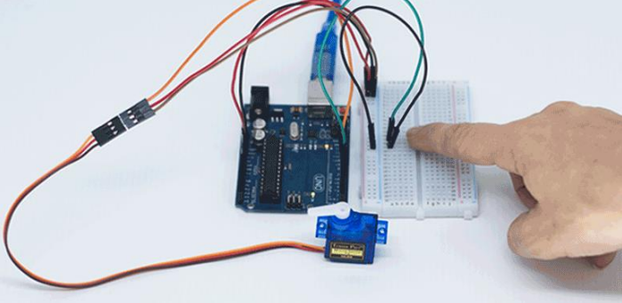
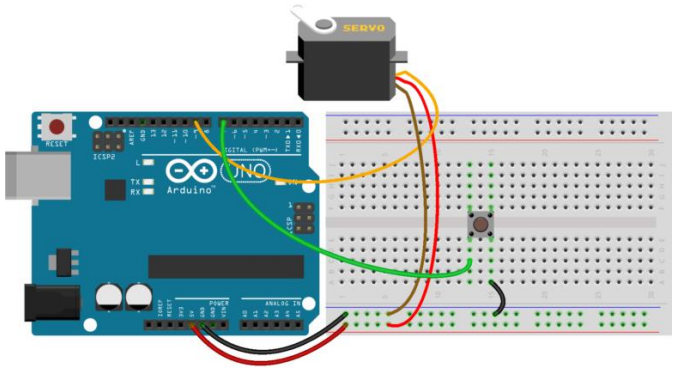
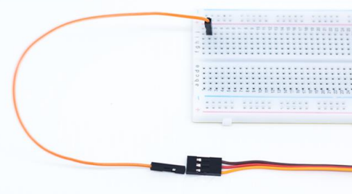
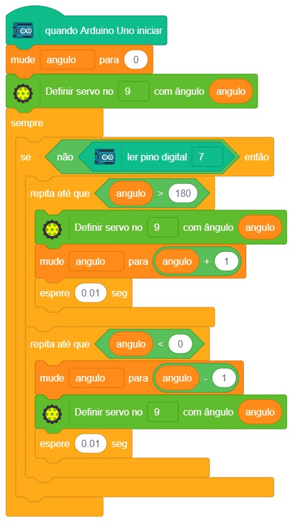

# Acionando um Motor

  

Existem diversos tipos de motor que podem ser utilizados facilmente com o Arduino. Entre os mais fáceis de se utilizar está o servo motor, sendo bastante utilizado em aeromodelismo e outros projetos que precisam de pouco movimento.

## Material Necessário

- 1x Servo 9g
- 1x Chave push-button
- 7x Jumper Macho-macho
- 1x Cabo USB
- 1x Placa Uno

## Montagem do circuito

O servo possui três fios para sua utilização e na extremidade desses fios um conector de 3 pinos fêmea. O fio marrom do servo deve ser conectado ao GND, o fio vermelho ao 5 V e o fio laranja ao pino 9 do Arduino. Na ilustração abaixo o fio preto corresponde ao marrom, o fio vermelho ao vermelho e o fio amarelo ao fio laranja.

Para conectar o servo basta utilizar 3 jumpers macho-macho e ligar o conector do servo com a protoboard. Também acompanha algumas hastes e parafusos. Não é necessário parafusar as hastes ao servo, apenas um encaixe já basta. Você pode escolher uma das hastes para visualizar melhor o movimento do servo.

## Programação

O programa consiste em alternar cada uma das cores do LED em um intervalo de 1 segundo.

### Para PictoBlox

A programação de blocos pode ser vista na figura a baixo.

### Para ArduinoIDE

O código para programação na interface ArdunoIDE pode ser encontrado [aqui](ArduinoIDE/ArduinoIDE.cpp).

## Possíveis erros

Caso o projeto não funcione, verifique alguns dos possíveis erros:

- Verifique se os jumpers estão na mesma coluna dos terminais dos componentes, fazendo assim a conexão;
- Verifique se os jumpers estão ligados nos pinos corretos no Arduino;
- Verifique se as conexões do servo estão corretas, fio marrom no GND, fio vermelho no 5 V e laranja no pino 9;
- Verifique se os pinos do botão estão bem inseridos na protoboard;
- Verifique se o código carregou na placa através da IDE Arduino.

## Desafios

Veja abaixo alguns desafios que você pode tentar!

- Mude o programa para que o servo gire apenas entre os angulos 50 e 110 graus.
