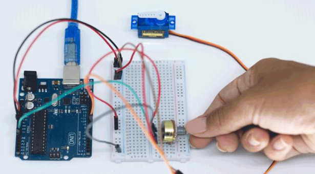
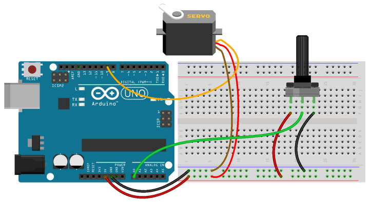
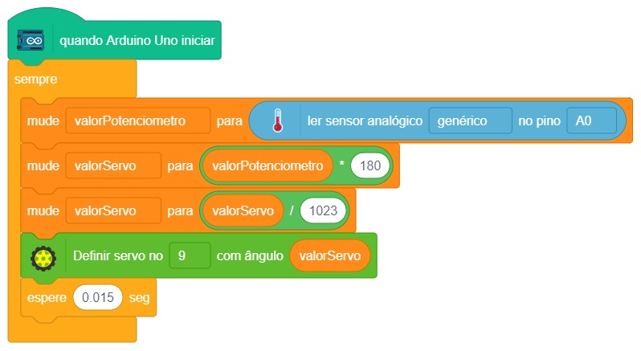

# Controlando o motor

  

Já vimos no projeto 7 como funciona um potenciômetro e no projeto 8 como funciona um servo motor. No projeto 9, veremos como utilizar esses dois componentes em conjunto controlando o servo através da rotação do potenciômetro.

É interessante observar como os dois componentes utilizam portas analógicas. Com isso podemos ler diversos valores no potenciômetro e mandar esses valores diversos para o motor. Não é apenas um comando de ligado e desligado, como no Projeto 5 Interruptor de luz.

## Material Necessário

- 1x Servo 9g
- 1x Potenciômetro 10K ohm
- 8x Jumper macho-macho
- 1x Cabo USB
- 1x Placa Arduino Uno

## Montagem do circuito

Como já visto no projeto 8, o servo possui três fios para sua utilização e na extremidade desses fios um conector de 3 pinos fêmea. O fio marrom do servo deve ser conectado ao GND, o fio vermelho ao 5 V e o fio laranja ao pino 9 do Arduino. Para conectar o servo basta utilizar 3 jumpers macho-macho. Também acompanha algumas hastes e parafusos. Não é necessário parafusar as hastes ao servo, apenas um encaixe já basta.
Adicione também na montagem o potenciômetro, como visto no Projeto 7.

## Programação

O programa consiste em ler o valor de rotação do potenciômetro e controlar a rotação do servo de acordo.

### Para PictoBlox

A programação de blocos pode ser vista na figura a baixo.

### Para ArduinoIDE

O código para programação na interface ArdunoIDE pode ser encontrado [aqui](ArduinoIDE/ArduinoIDE.cpp).

## Possíveis erros

Caso o projeto não funcione verifique alguns dos possíveis erros:

- Verifique se os jumpers estão na mesma coluna dos terminais dos componentes, fazendo assim a conexão;
- Verifique se os jumpers estão ligados nos pinos corretos no Arduino;
- Verifique se as conexões do servo estão corretas, fio marrom no GND, fio vermelho no 5V e laranja no pino 9;
- Verifique se os pinos do potenciômetro estão bem inseridos na protoboard;
- Verifique se o código carregou na placa através da IDE Arduino.

## Desafios

Veja abaixo alguns desafios que você pode tentar!

- Mude o programa para que o servo gire apenas entre os angulos 50 e 110 graus.
