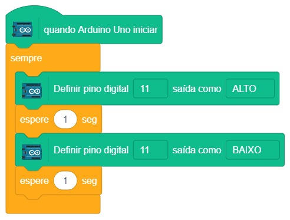

# Pisca Pisca

  

Neste primeiro projeto iremos fazer uma luz piscar. Parece um projeto simples demais, mas isso exemplifica a utilização do Arduino para controle de dispositivos externos. Os conceitos aprendidos neste exemplo servem para acionamento de outros dispositivos como ventilador, lâmpadas, motores e etc.

Fazer uma luz piscar é um projeto tão importante, que existe até uma competição internacional para ver quem faz uma luz piscar de maneira mais impressionante, mostrando domínio de eletrônica e programação. É o primeiro passo que se dá quando se começa a trabalhar com uma placa, porque ele mostra que você é capaz de programá-la. Esse primeiro projeto será um pequeno grande passo para que você aprenda eletrônica e programação e possa fazer projetos mais complexos.

Sabemos que o guia para este primeiro projeto está bastante longo, mas depois que você entende como funciona, não irá precisar de tantas instruções para conseguir reproduzir um projeto.

## Material Necessário

- 1x LED Vermelho5 mm
- 1x Resistor 220 ohm
- 1x Protoboard
- 2x Jumper macho-macho
- 1x Cabo USB
- 1x Placa Arduino Uno

## Montagem do circuito

No caso do nosso projeto, a fonte de energia vem da porta 11 do Arduino.

Com a programação correta, é possível ligar e desligar a energia do pino 11, fazendo o LED acender e apagar. No esquema da montagem do circuito, as linhas coloridas são a representação gráfica dos jumpers. Utilize-os para ligar os componentes entre si conforme a ilustração abaixo. Note que o pino 11 está conectado ao lado positivo do LED, enquanto o GND vai no pino negativo, passando antes pelo resistor.

## Programação

### Para PictoBlox

A programação de blocos pode ser vista na figura a baixo. Monde no programa PictoBlox e teste seu funcionamento.

### Para ArduinoIDE

O código para programação na interface ArdunoIDE pode ser encotnrado [aqui](ArduinoIDE/ArduinoIDE.cpp).

## Possíveis erros

Caso o projeto não funcione, verifique alguns dos possíveis erros:

- Na hora da checagem, apareceu alguma mensagem em vermelho?
- Caso esteja utilizando o ArduinoIDE, verifique o código e caso não encontre o problema, copie e cole novamente o código no ArduinoIDE e tente mais uma vez;
- Caso esteja utilizando o Pictoblox, confira se todos os blocos estão corretamente conectados;
- Verifique se os jumpers estão na mesma coluna dos terminais dos componentes, fazendo assim a conexão;
- Verifique se os jumpers estão ligados nos pinos corretos no Arduino;
- Verifique se o LED não está conectado invertido ou seja, terminal negativo no pino 11 e positivo no pino GND;
- Verifique se o código carregou na placa através do PictoBlox ou do ArduinoIDE.

## Desafios

- Troque o LED por outro de cor diferente;
- Monte o circuito de uma maneira alternativa usando outros furos e posições na protoboard;
- Mude o intervalo de tempo que o LED pisca mudando o valor nos blocos `espere (1) seg` para `espere (0.25) seg` ou se estiver utilizando o ArduinoIDE mude a programação na linha `delay(1000);` para `delay(250);`;
- Monde mais um LED no pino 12 do Arduino. Altere a programação para que enquanto um LED esteja ligado o outro esteja apagado.
