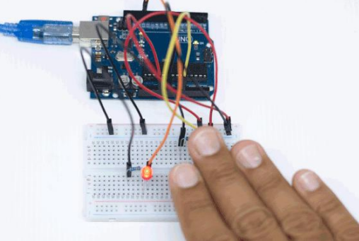
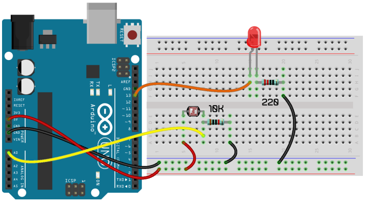
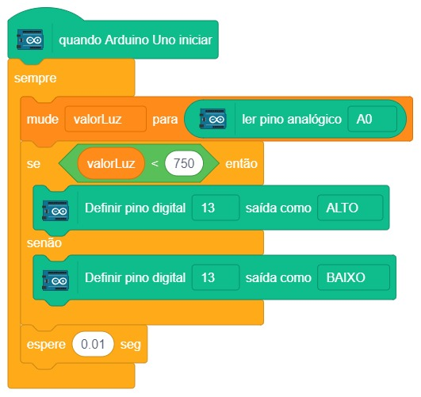

# Projeto 10 – Sensor de luz ambiente

  

Neste projeto iremos mostrar que é possível identificar a quantidade de luz presente em um ambiente utilizando o Arduino e o sensor de luminosidade LDR (Light Dependent Resistor). O LDR é bastante usado nos postes de luz na cidade, fazendo que quando anoiteça as luzes da cidade acendam. Ele também é usado em lâmpadas de jardim que acendem ao anoitecer. Veja neste projeto como utilizar o sensor de luz LDR com Arduino.
Assim como um potenciômetro varia sua resistência conforme a rotação, o LDR é um resistor que varia sua
resistência conforme a intensidade de luz no ambiente. Com isso conseguimos medir a quantidade de luz presente
em um ambiente.
Da mesma forma que o potenciômetro é ligado em uma entrada analógica do Arduino, também é possívelutilizar uma porta analógica para ler o valor de um LDR. Para o LED, iremos trabalhar apenas com uma porta digital. O projeto 10 consiste em ligar ou desligar o LED de acordo com a intensidade de luz presente no ambiente. Pouca luz acende o LED, bastante luz apaga o LED. Você pode variar a luz do ambiente acendendo ou apagando as luzes ou colocando a mão em cima do sensor LDR como mostrado abaixo.

## Material Necessário

- 1x LED Vermelho 5 mm
- 1x Resistor 220 ohm
- 1x Resistor 10K ohm
- 1x Sensor de luminosidade LDR
- 7x Jumper Macho-macho
- 1x Cabo USB
- 1x Placa Uno

## Montagem do circuito

Na montagem deste projeto, atente-se a montagem do LED, pois, como já mostramos no projeto 1, ele tem lado positivo e negativo. Já o sensor de luminosidade LDR não tem lado, ou seja apenas insira os seus pinos na protoboard e faça a ligação conforme indicado abaixo. Note que o LDR usa um resistor de 10K ohm e o LED um resistor de 100 ohm.

## Programação

O programa consiste em alternar cada uma das cores do LED em um intervalo de 1 segundo.

### Para PictoBlox

A programação de blocos pode ser vista na figura a baixo.

### Para ArduinoIDE

O código para programação na interface ArdunoIDE pode ser encontrado [aqui](ArduinoIDE/ArduinoIDE.cpp).

## Possíveis erros

Caso o projeto não funcione verifique alguns dos possíveis erros:

- Verifique se os jumpers estão na mesma coluna dos terminais dos componentes, fazendo assim a conexão;
- Verifique se os jumpers estão ligados nos pinos corretos no Arduino;
- Verifique se o valor de resistores está correto como indicado na montagem do projeto;
- Verifique se o código carregou na placa através da IDE Arduino.

## Simulação no TinkerCad

[Clique aqui](https://www.tinkercad.com/things/0Y83Xkimgp2-sizzling-elzing/editel?tenant=circuits)

## Formulário da Turma 602

[Clique aqui](https://forms.gle/Ve2gcCt1yGmon1SX6)

## Desafios

Veja abaixo alguns desafios que você pode tentar!

- Mude a sensibilidade do sensor LDR. Experimente valores como 600 ou 900. Lembrando que esse valor pode ser entre 0 e 1023;
- Modifique a programação para realizar o inverso do objetivo proposto. Pouca luz apaga o LED, bastante luz acende o LED.
