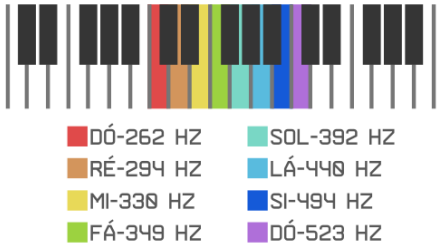

# Dó Ré Mi

  

Bora fazer música com o Arduino?

Na música, cada nota musical possui uma frequência específica dada em hertz (Hz). Olhando as teclas de um piano é possível ver a frequência de cada uma das notas de uma escala de Dó por exemplo. No projeto 11 iremos mostrar como é possível reproduzir notas musicais utilizando um buzzer com Arduino.

O buzzer é um pequeno alto falante capaz de gerar tons em frequências determinadas, sendo possível, então, tocar pequenas músicas ou alarmes. Ele é bastante encontrado em brinquedos ou relógios digitais com alarme. No Arduino podemos utilizar a função chamada tone(); que leva dois parâmetros: o pino em que o buzzer está conectado e a frequência do tom. O projeto 11 consiste em tocar a escala de dó com Arduino e buzzer.

## Material Necessário

- 1x Buzzer
- 2x Jumper Macho-macho
- 1x Protoboard
- 1x Cabo USB
- 1x Placa Uno

## Montagem do circuito

A montagem deste circuito é feita como se fossem três LEDs colocados no mesmo projeto. Adicione um resistor para cada perna de cor do LED RGB e conecte o pino 5 V do Arduino à perna positiva do LED RGB. Cada pino de cor do LED é conectado a uma porta digital do Arduino.

## Programação

### Para PictoBlox

A programação de blocos pode ser vista na figura a baixo.

Não esqueça de criar os métodos antes de programar a função principal.

### Para ArduinoIDE

O código para programação na interface ArdunoIDE pode ser encontrado [aqui](ArduinoIDE/ArduinoIDE.cpp).

## Possíveis erros

Caso o projeto não funcione, verifique alguns dos possíveis erros:

- Verifique se os jumpers estão na mesma coluna dos terminais dos componentes, fazendo assim a
  conexão;
- Verifique se os jumpers estão ligados nos pinos corretos no Arduino;
- Verifique se o código carregou na placa através da IDE Arduino.

## Simulação no TinkerCad

[Clique aqui](https://www.tinkercad.com/things/jFERTptmmDp-incredible-curcan-jaiks/editel?tenant=circuits)

## Desafios

Veja abaixo alguns desafios que você pode tentar!

- Modifique os valores de frequência das notas, dobre todos os valores e veja o que acontece;
- Modifique o tempo entre cada nota;
- Toque uma sequência de notas diferentes para fazer uma música que você conheça.
