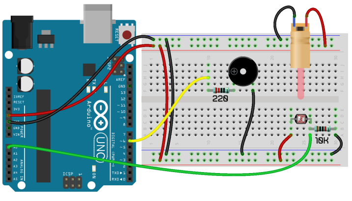
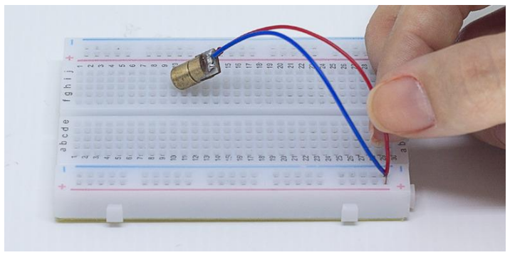
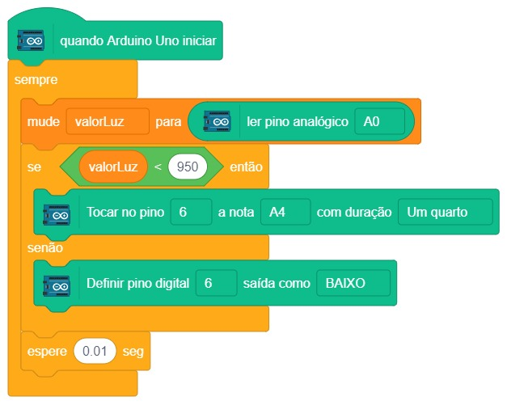

# Alarme com Sensor a Laser

  

Para este projeto, vamos combinar o Projeto 10 e o Projeto 11 para criar um detector de presença a laser, igual àqueles que vemos em filmes de espionagem, mas com um laser somente. Claro que aprendendo o funcionamento deste projeto você pode juntar mais lasers e fazer um sensor mais parecido com os encontrados em filmes.

O diodo laser é um LED que possui uma lente especial que gera um feixe de luz de longo alcance e, normalmente, em formato de ponto. Nesse projeto também iremos utilizar o sensor de luz LDR para detectar o laser e o buzzer para realizar sinais sonoros. No projeto 12 iremos fazer um protótipo de alarme por laser. O laser deve ser apontado para o LDR, para que o sensor detecte bastante luz, e quando algo cortar o feixe de luz, o buzzer irá soar como um alarme. Veja como o projeto irá funcionar.

## Material Necessário

- 1x Diodo Laser
- 1x Resistor 10K ohm
- 1x LDR
- 1x Buzzer
- 9x Jumper Macho-macho
- 1x Cabo USB
- 1x Placa Uno

## Montagem do circuito

Na montagem abaixo note que o laser está com os fios conectados diretamente na protoboard e apontando para o LDR. Caso o laser não acenda, verifique se fios foram colocados até o fundo dos furos da protoboard. Atenção! Não aponte o laser diretamente no seu olho ou de outra pessoa.

Veja como deve ser feita a montagem do laser.

## Programação

No programa abaixo, quando o laser não estiver apontado para o LDR, o buzzer irá soar. Sendo assim, aponte o laser para o LDR e corte o feixe de luz com um objeto para que o alarme acione.

### Para PictoBlox

A programação de blocos pode ser vista na figura a baixo.

Não esqueça de criar os métodos antes de programar a função principal.

### Para ArduinoIDE

O código para programação na interface ArdunoIDE pode ser encontrado [aqui](ArduinoIDE/ArduinoIDE.cpp).

## Possíveis erros

Caso o projeto não funcione, verifique alguns dos possíveis erros:

- Verifique se os jumpers estão na mesma coluna dos terminais dos componentes, fazendo assim a
  conexão;
- Verifique se os jumpers estão ligados nos pinos corretos no Arduino;
- Verifique se os valores de resistores estão corretos como indicado na montagem;
- Verifique se o laser está com os fios bem inseridos nos furos da protoboard;
- Verifique se o código carregou na placa através da IDE Arduino.

## Simulação no TinkerCad

[Clique aqui](https://www.tinkercad.com/things/hMgOrhzTQK2-sizzling-habbi-vihelmo/editel?sharecode=BwEb_tGFlZbPMNaDdoZwBle76vmzfCx_cePUzpRlWuk)

## Formulário da Turma 602

[Clique aqui](https://forms.gle/h9rwzn2p4KDrPyCv7)

## Desafios

Veja abaixo alguns desafios que você pode tentar!

- Altere para que o buzzer toque em um outro tom;
- Modifique a programação para acionar um alarme intermitente;
- Modifique a programação para realizar o inverso do objetivo proposto. Laser apontado para o LDR aciona o buzzer.
