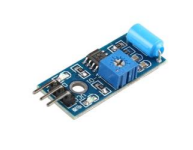
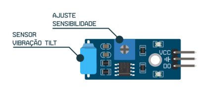
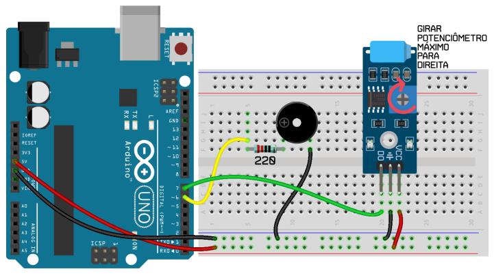
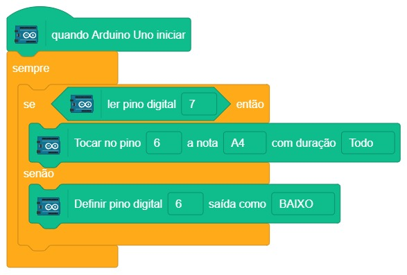

# Alarme de movimento

  

No Projeto 13, faremos um alarme que apita quando detecta movimento. Para o apito utilizaremos o já conhecido buzzer, e para detectar o movimento iremos utilizar o sensor de vibração e movimento tilt, que funciona como um botão que é acionado ao ser inclinado ou agitado. Ao ser agitado, ele envia a informação de inclinação que pode ser lida pelo Arduino e, uma ação pode ser tomada.

O sensor de vibração tilt tem um formato de módulo que contém a cápsula azul e também um pequeno potenciômetro para ajuste da sensibilidade.

## Material Necessário

- 1x Sensor de vibração tilt
- 1x Chave de ajuste para sensor de vibração
- 1x Buzzer
- 7x Jumper Macho-macho
- 1x Cabo USB
- 1x Placa Uno

## Montagem do circuito

Monte o projeto como abaixo encaixando os pinos do módulo de vibração tilt na protoboard. Para que o projeto funcione adequadamente é necessário ajustar o sensor de vibração tilt através do pequeno potenciômetro azul, girando-o totalmente para direita como indicado pela seta vermelha.

## Programação

### Para PictoBlox

A programação de blocos pode ser vista na figura a baixo.

Não esqueça de criar os métodos antes de programar a função principal.

### Para ArduinoIDE

O código para programação na interface ArdunoIDE pode ser encontrado [aqui](ArduinoIDE/ArduinoIDE.cpp).

## Possíveis erros

Caso o projeto não funcione, verifique alguns dos possíveis erros:

- Verifique se os jumpers estão na mesma coluna dos terminais dos componentes, fazendo assim a conexão;
- Verifique se os jumpers estão ligados nos pinos corretos no Arduino;
- Verifique se o potenciômetro do sensor de vibração foi ajustado conforme instrução da montagem;
- Verifique se o código carregou na placa através da IDE Arduino.

## Desafios

Veja abaixo alguns desafios que você pode tentar!

- Altere para que o buzzer toque em um outro tom;
- Modifique a programação para acionar um alarme intermitente.
