# Contador Digital

  

O contador digital é um display de um dígito que vai aumentando conforme o tempo. Como ele é um contador de um dígito apenas, começa em 0 e vai até 9. O projeto 9 parece um projeto um pouco simples, mas que ensina o funcionamento de um display bastante usado em projetos de eletrônica.

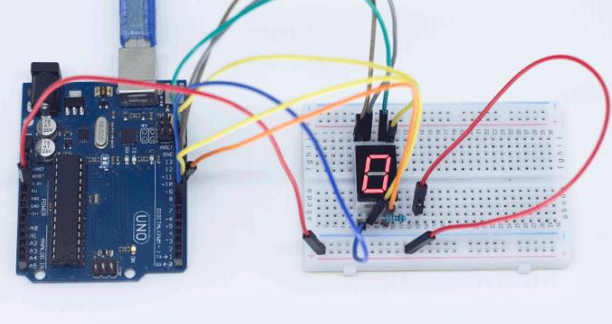

## Material Necessário

- 1x Display 7 segmentos
- 1x Resistor 220 ohm
- 10x Jumper Macho-macho
- 1x Cabo USB
- 1x Placa Uno

## Montagem do circuito

Existem dois tipos de display de 7 segmentos. O de ânodo comum e o de cátodo comum. A diferença está no posicionamento dos LEDs na construção interna do display.

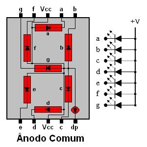
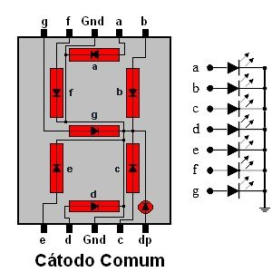

Como se fossem vários LEDs, precisamos colocar um pino do Arduino para cada pino do display. Como iremos utilizar o display de cátodo comum, o lado negativo dos LEDs é comum a todos.

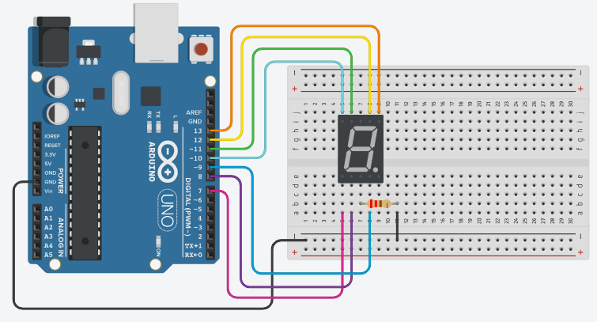

## Programação

O programa, apesar de comprido, é bastante simples. Apenas acendemos e apagamos os LEDs, conforme o número que desejamos.

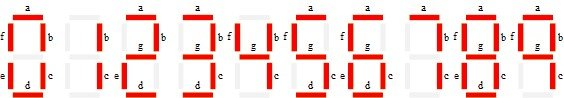

### Para PictoBlox

A programação de blocos pode ser vista na figura a baixo.

Não esqueça de criar os métodos antes de programar a função principal.

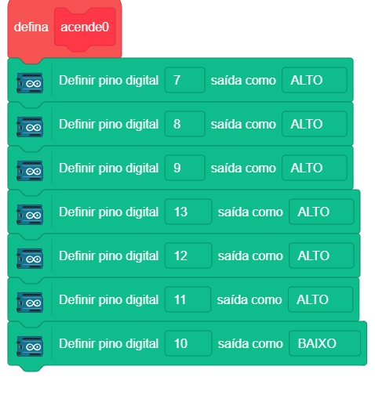
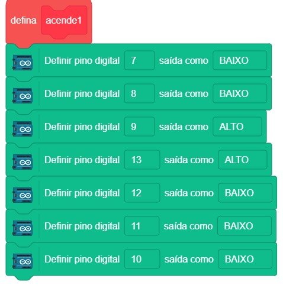
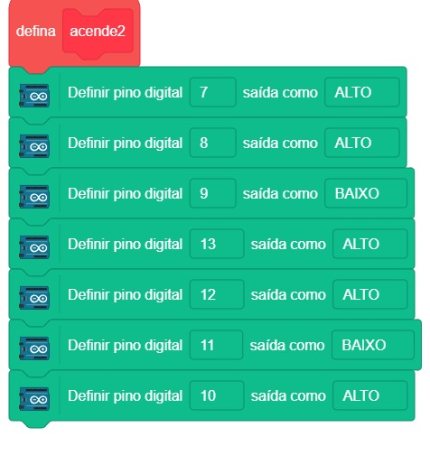
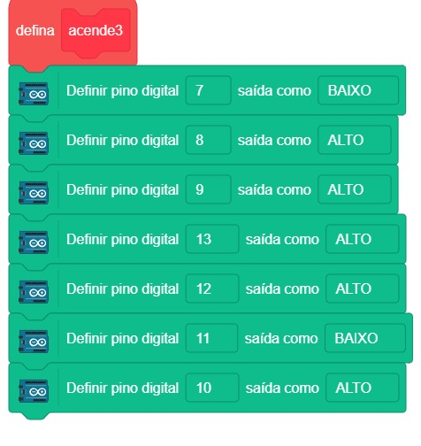
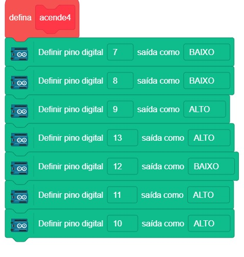
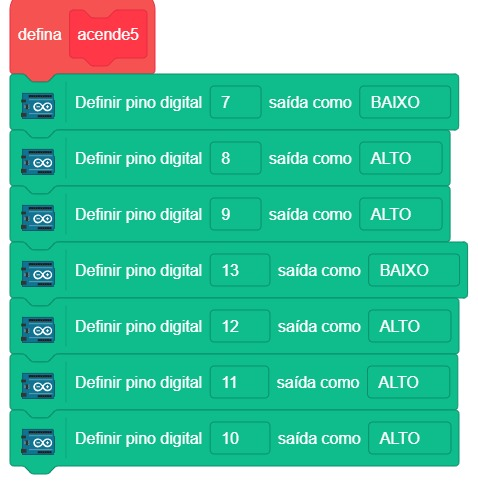
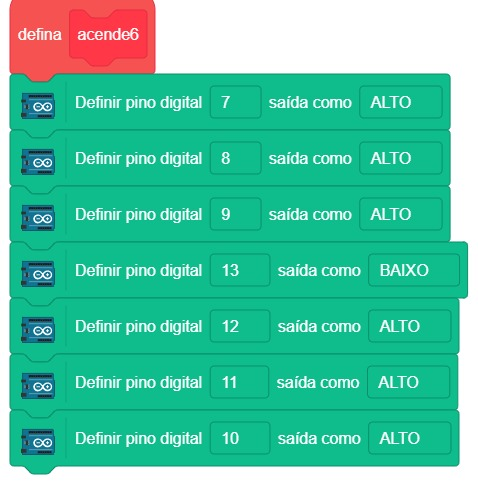
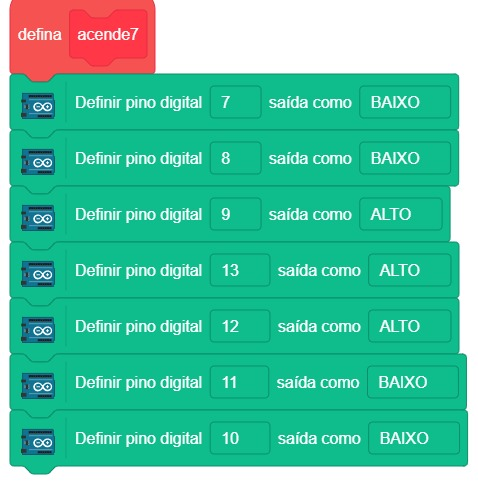
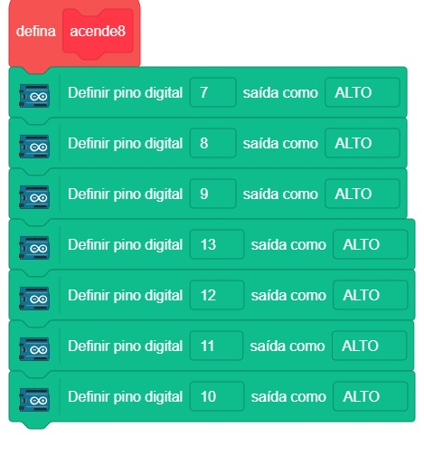
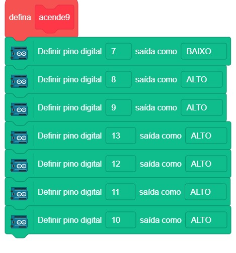
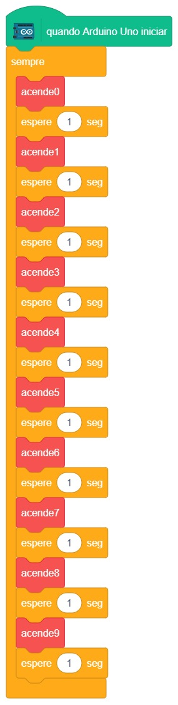

### Para ArduinoIDE

O código para programação na interface ArdunoIDE pode ser encontrado [aqui](ArduinoIDE/ArduinoIDE.cpp).

## Possíveis erros

Caso o projeto não funcione verifique alguns dos possíveis erros:

- Caso o display não acenda nenhum LED, verifique a ligação do pino comum;
- Caso o display não acenda algum segmento, verifique a ligação desse segmento;
- Verifique se os jumpers estão na mesma coluna dos terminais dos componentes, fazendo assim a
  conexão;
- Verifique se os jumpers estão ligados nos pinos corretos no Arduino;
- Verifique se o código carregou na placa através da IDE Arduino.

## Simulação no TinkerCad

[Clique aqui](https://www.tinkercad.com/things/07riAy2WCXb-neat-uusam-jofo/editel?sharecode=L1E8_3itbHKKFieqsK_Or2liVjPFBV2keDfPsqTc-eY)

## Desafios

Veja abaixo alguns desafios que você pode tentar!

- Modifique o tempo de exibição entre um número e outro mudando os valores em `delay(1000);` por
  exemplo `delay(350);`
- Modifique a sequência de exibição dos números fazendo uma contagem regressiva;
- Desenhe letras no display criando novas funções para elas. Por exemplo a letra A.
  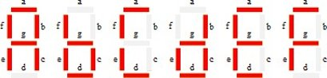
