# Dado Eletrônico

  

Vamos construir um dado que rola ao sentir movimento. Para este projeto iremos juntar dois componentes que já vimos anteriormente, um display de 7 segmentos e um sensor de vibração tilt. Ao agitar o sensor de vibração tilt, o display deverá mostrar números aleatórios até parar, simulando o funcionamento de um dado de 10 lados.

## Material Necessário

- 1x Display 7 segmentos
- 1x Resistor 220 ohm
- 1x Sensor tilt
- 13x Jumper Macho-macho
- 1x Cabo USB
- 1x Placa Uno

## Montagem do circuito

Para que o projeto funcione adequadamente é necessário ajustar o sensor de vibração tilt através do pequeno potenciômetro azul, girando-o totalmente para direita como indicado pela seta vermelha. Se precisar, use a chave que veio junto do kit.

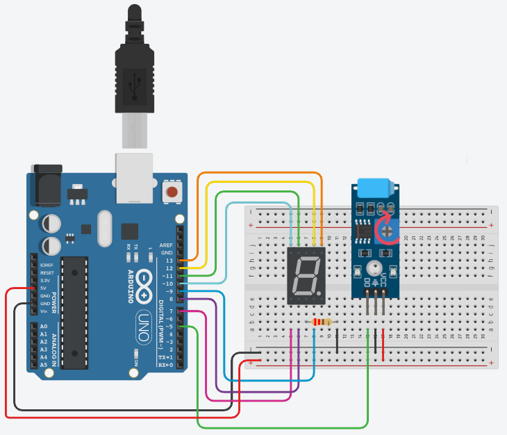

## Programação

Este programa é diferente do projeto que utiliza o Buzzer porque dessa vez, em vez de tocar um Buzzer ao se movimentar, gera um número aleatório. O funcionamento e a programação do display de 7 segmentos são os mesmos vistos no Projeto 14.

### Para PictoBlox

A programação de blocos pode ser vista na figura a baixo.

Não esqueça de criar os métodos antes de programar a função principal.

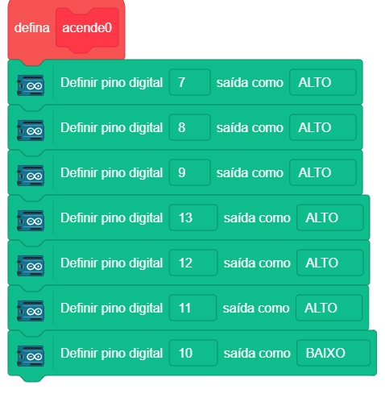
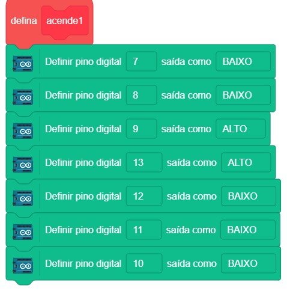
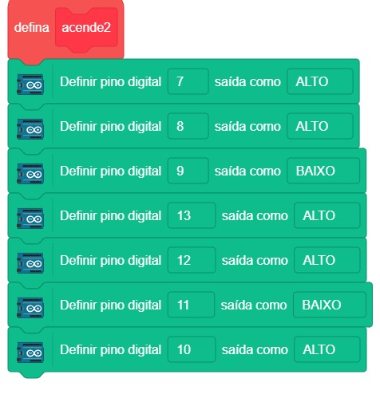
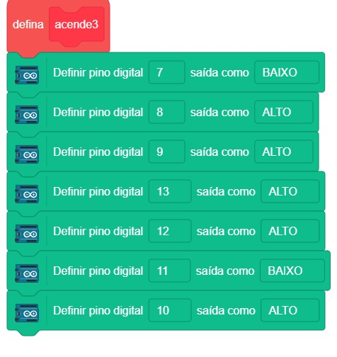
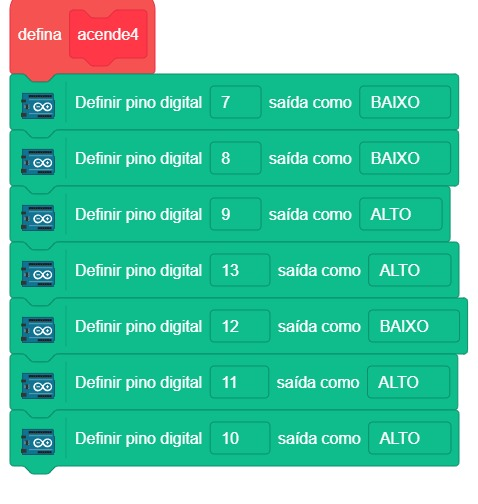
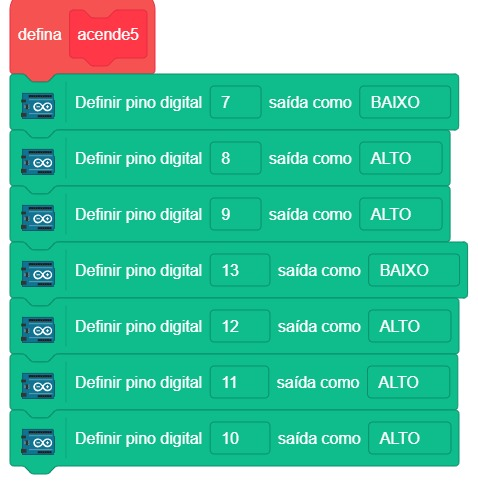
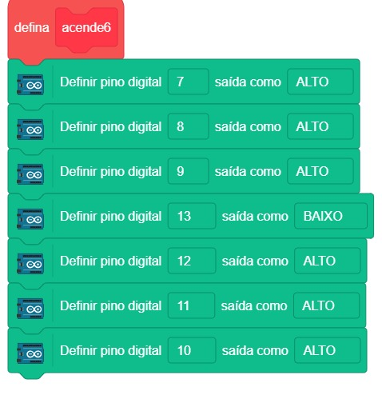
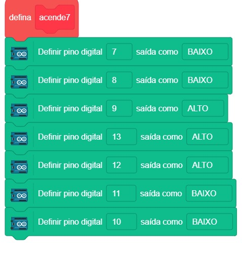
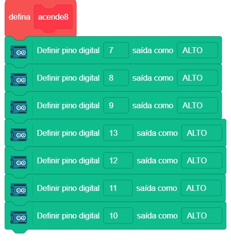
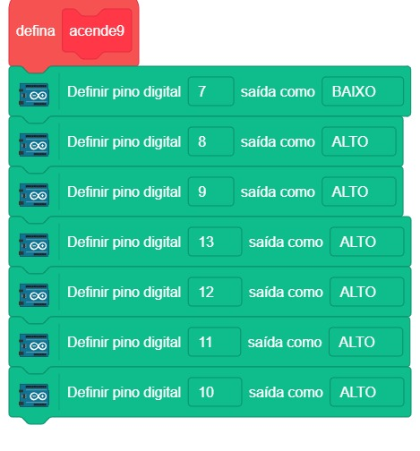
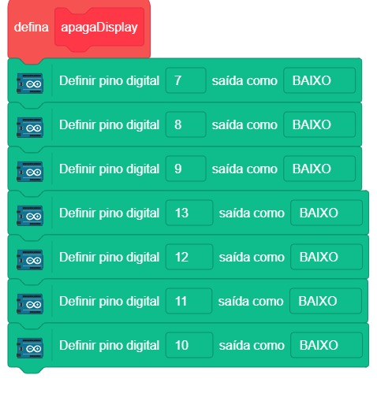
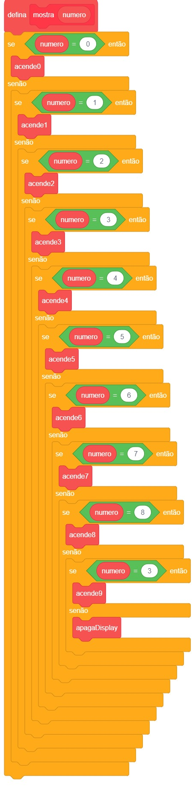
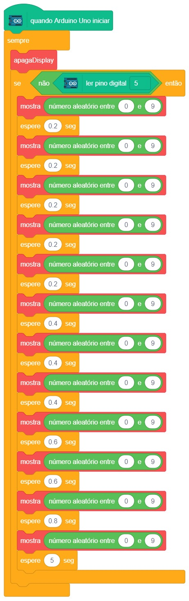

### Para ArduinoIDE

O código para programação na interface ArdunoIDE pode ser encontrado [aqui](ArduinoIDE/ArduinoIDE.cpp).

## Possíveis erros

Caso o projeto não funcione verifique alguns dos possíveis erros:

- Verifique se os jumpers estão na mesma coluna dos terminais dos componentes, fazendo assim a conexão;
- Verifique se os jumpers estão ligados nos pinos corretos no Arduino;
- Certifique-se de ter girado o potenciômetro do sensor todo para direita como indicado na montagem;
- Verifique se o código carregou na placa através da IDE Arduino.

## Simulação no TinkerCad

[Clique aqui](https://www.tinkercad.com/things/8VBFf7Yf9Kq-15-dado-eletronico/editel?sharecode=QyuijxV6vjzBdOPw_U1rTziJmOd5PtTdCHIi2irN0cI)

## Desafios

Veja abaixo alguns desafios que você pode tentar!

- Tente fazer um dado eletrônico que exiba letras de A até F ao invés de números;
- Altere a programação para que se comporte como um dado de 6 lados.
