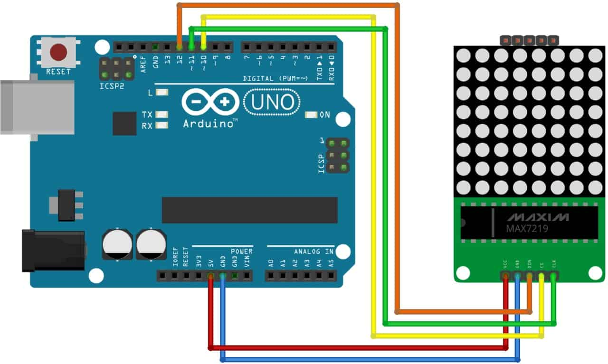
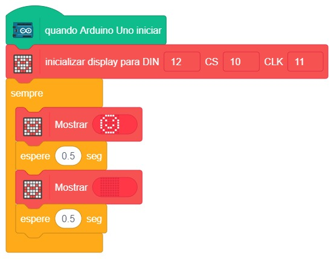

# Matriz de LEDs 8x8

  

Neste projeto, vamos explorar como utilizar a Matriz de LED 8×8 MAX7219 em conjunto com o Arduino. Vamos criar uma conexão entre um módulo de matriz LED 8×8, equipado com o driver MAX7129, e uma placa Arduino Uno. Essa matriz consiste em 64 LEDs (Light Emitting Diodes - Diodos Emissores de Luz) organizados em uma grade de 8 linhas por 8 colunas, daí o nome "matriz de LED".

Durante este projeto, iremos criar diversos padrões de deslocamento de LEDs, personalizá-los e exibi-los na matriz de LED, utilizando diferentes códigos programados para o Arduino.

## Material Necessário

- 1x Matriz LED 8X8 com MAX7219
- 5x Jumper Macho-fêmea
- 1x Cabo USB
- 1x Placa Arduino Uno

## Montagem do circuito

O diagrama de circuito para interface 8×8 LED Matrix MAX7219 com Arduino é mostrado abaixo.

D10 ------------------LOAD ou CHIP SELECT\
D11 ------------------CLOCK\
D12 ------------------DATA IN\
+5V ------------------VCC\
GND ------------------GND

## Programação

Este programa é diferente do projeto que utiliza o Buzzer porque dessa vez, em vez de tocar um Buzzer ao se movimentar, gera um número aleatório. O funcionamento e a programação do display de 7 segmentos são os mesmos vistos no Projeto 14.

### Para PictoBlox

A programação de blocos pode ser vista na figura a baixo.

### Para ArduinoIDE

O código para programação na interface ArdunoIDE pode ser encontrado [aqui](ArduinoIDE/ArduinoIDE.cpp).

## Possíveis erros

Caso o projeto não funcione verifique alguns dos possíveis erros:

- Verifique se os jumpers estão na mesma coluna dos terminais dos componentes, fazendo assim a conexão;
- Verifique se os jumpers estão ligados nos pinos corretos no Arduino;
- Verifique se o código carregou na placa através da IDE Arduino.

## Desafios

Veja abaixo alguns desafios que você pode tentar!

- Teste outros desenhos no display;
- Desenhe no display o seu nome, letra a letra com itervalos de 1 segundo;
- Adicione um potenciometro ao projeto, faça a leitura analógica dele. Desenhe um coração fazio, conforme o potenciomentro é girado, o coração deve ser preenchido.
