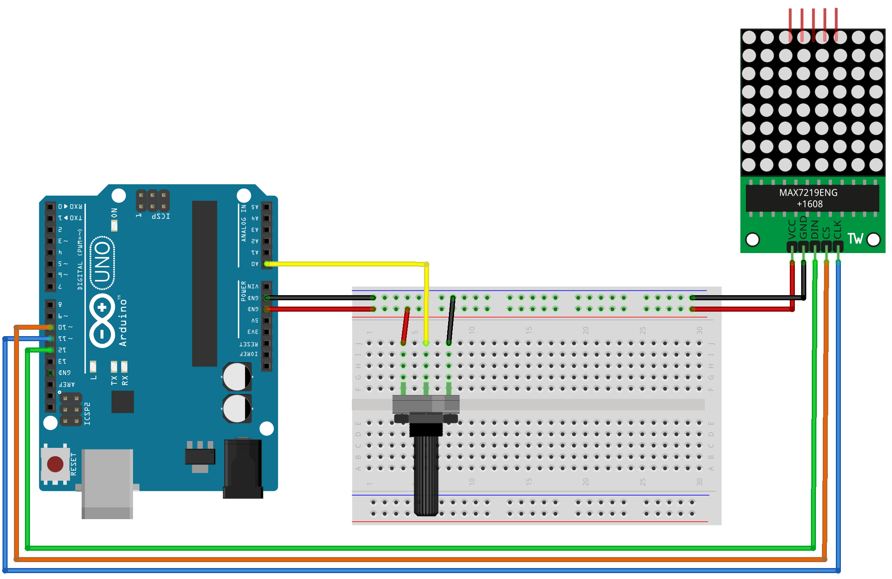
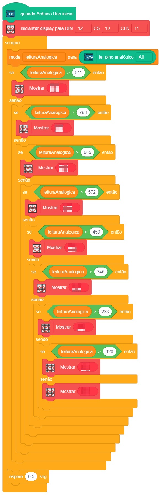

# Matriz de LEDs 8x8 com entrada analógica

  

Neste projeto, vamos explorar como utilizar a Matriz de LED 8×8 MAX7219 em conjunto com um potenciômetro. Vamos criar uma conexão entre um módulo de matriz LED 8×8, equipado com o driver MAX7129, e uma placa Arduino Uno. Também vamos conectar um potenciômetro a uma entrada anaógica do Arduino UNO.

## Material Necessário

- 1x Matriz LED 8X8 com MAX7219
- 5x Jumper Fêmea-fêmea
- 10x Jumper Macho-macho
- 1x Potenciômetro
- 1x Cabo USB
- 1x Placa Arduino Uno

## Montagem do circuito

O diagrama de circuito é mostrado abaixo.

D10 ------------------LOAD ou CHIP SELECT\
D11 ------------------CLOCK\
D12 ------------------DATA IN\
+5V ------------------VCC\
GND ------------------GND

## Programação

O programa faz com que conforme o potenciômetro é variado, o display vai sendo preenchido.

### Para PictoBlox

A programação de blocos pode ser vista na figura a baixo.

### Para ArduinoIDE

O código para programação na interface ArdunoIDE pode ser encontrado [aqui](ArduinoIDE/ArduinoIDE.cpp).

## Possíveis erros

Caso o projeto não funcione verifique alguns dos possíveis erros:

- Verifique se os jumpers estão na mesma coluna dos terminais dos componentes, fazendo assim a conexão;
- Verifique se os jumpers estão ligados nos pinos corretos no Arduino;
- Verifique se o código carregou na placa através da IDE Arduino.

## Desafios

Veja abaixo alguns desafios que você pode tentar!

- Altere o projeto que seja preenchido um coração no lugar de um quadrado;
- Substitua o potenciômetro por um sensor analógico, por exemplo um LDR.
