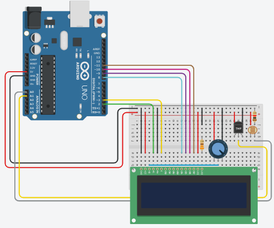
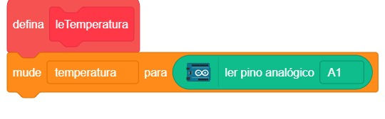
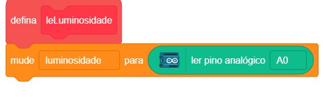
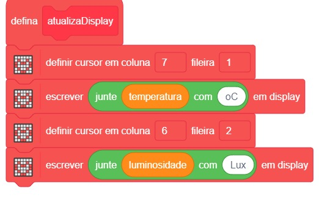
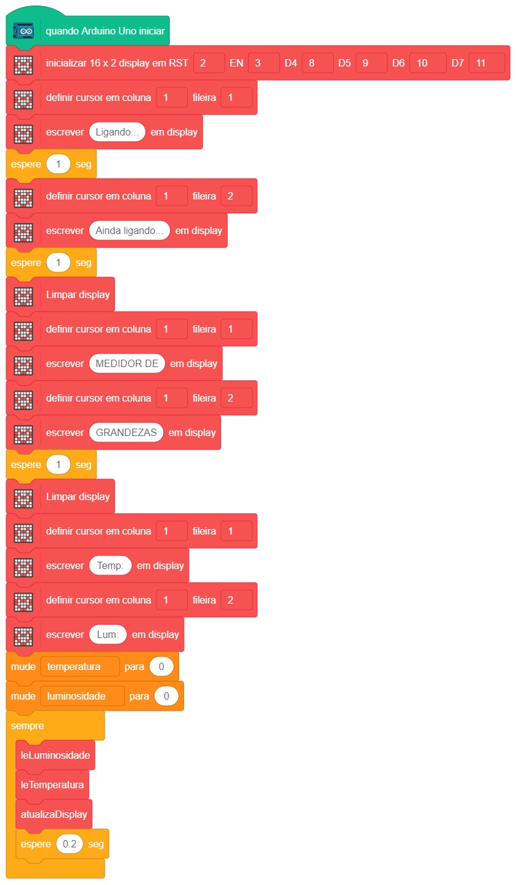

# Display 16x2 - Medidor de temperatura e luminosidade

  

Neste projeto, vamos explorar como utilizar o display 16x2 em conjunto com um sensor de temperatura e um LDR. Vamos criar uma conexão entre o display e uma placa Arduino Uno.

## Material Necessário

- 1x Display 16x2
- 21x Jumper Macho-macho
- 1x Potenciômetro
- 1x LDR
- 1x LM35
- 2x Resistor de 220Ω ou 330Ω
- 1x Resistor de 1kΩ
- 1x Cabo USB
- 1x Placa Arduino Uno

## Montagem do circuito

O diagrama de circuito é mostrado abaixo.

### Ligação do display 16x2

VCC ------------------ 5V\
GND ------------------ GND\
V0 ------------------ Meio do potenciometro\
RS ------------------ 2\
RW ------------------ GND\
E ------------------ 3\
DB4 ------------------ 8\
DB5 ------------------ 9\
DB6 ------------------ 10\
DB7 ------------------ 11\
LED (Anodo) ------------------ 5V\
LED (Catodo) ------------------ Resistor 220Ω

## Programação

Conforme a temperatura e a luminosidade varia o display 16x2 será atualizado.

### Para PictoBlox

A programação de blocos pode ser vistas nas figuras a baixo.

### Para ArduinoIDE

O código para programação na interface ArdunoIDE pode ser encontrado [aqui](ArduinoIDE/ArduinoIDE.cpp).

## Simulação no TinkerCad

[Clique aqui](https://www.tinkercad.com/things/cOQqalHQLsP-display-16x2-temperatura-e-luminosidade/editel)

## Possíveis erros

Caso o projeto não funcione verifique alguns dos possíveis erros:

- Verifique se os jumpers estão na mesma coluna dos terminais dos componentes, fazendo assim a conexão;
- Verifique se os jumpers estão ligados nos pinos corretos no Arduino;
- Verifique se o código carregou na placa através da IDE Arduino.

## Desafios

Veja abaixo alguns desafios que você pode tentar!

- A temperatura apresentada pelo display está errada. Para que o valor apresentado no display esteja correta, a calcule-o pela equação: $$Temperatura = \frac{leituraAnalogica * 5}{1023}*0,01$$
