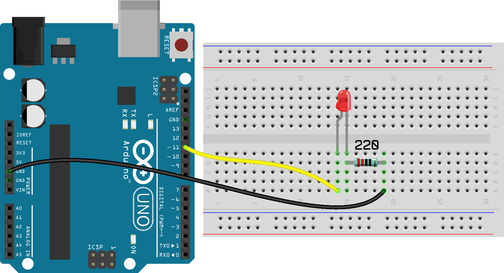

# Pisca Pisca

  

Você já deve ter visto nos filmes quando as pessoas enviam pedido de socorro SOS em código morse. Neste projeto iremos piscar um LED no padrão SOS. A letra S são 3 piscadas curtas indicando o ponto do código morse e a letra O são 3 piscadas um pouco mais longas indicando o traço do código morse.

Este projeto mostra que, através da programação, podemos piscar o LED de diferentes maneiras e intervalos de tempo.

## Material Necessário

- 1x LED Vermelho5 mm
- 1x Resistor 220 ohm
- 1x Protoboard
- 2x Jumper macho-macho
- 1x Cabo USB
- 1x Placa Arduino Uno

## Montagem do circuito

Nesse projeto vamos utilizar o mesmo circuito do [Projeto Pisca Pisca](/Projeto1/README.md).

## Programação

O programa, como feito com o Projeto Pisca pisca, acende e apaga a luz conforme um padrão. Como algumas coisas se repetem, foi acrescentada uma estrutura no código para repetição.

A ideia não é entender exatamente como as estruturas de repetição funcionam, mas sim que elas existem. Quando precisar utilizar alguma dessas estruturas em um projeto, você pode procurar como é feito, ou mesmo alterar os valores nesse código.

### Para PictoBlox

A programação de blocos pode ser vista na figura a baixo.

### Para ArduinoIDE

O código para programação na interface ArdunoIDE pode ser encotnrado [aqui](ArduinoIDE/ArduinoIDE.cpp).

## Possíveis erros

Caso o projeto não funcione verifique alguns dos possíveis erros:

- Verifique se os jumpers estão na mesma coluna dos terminais dos componentes, fazendo assim a conexão;
- Verifique se os jumpers estão ligados nos pinos corretos no Arduino;
- Verifique se o LED não está conectado invertido, ou seja, terminal negativo no pino 11 e positivo no pino GND;
- Verifique se o código carregou na placa através do PictoBlox ou do ArduinoIDE.

## Desafios

- Troque o LED por outro de cor diferente;
- Monte o circuito de uma maneira alternativa usando outros furos e posições na protoboard.
