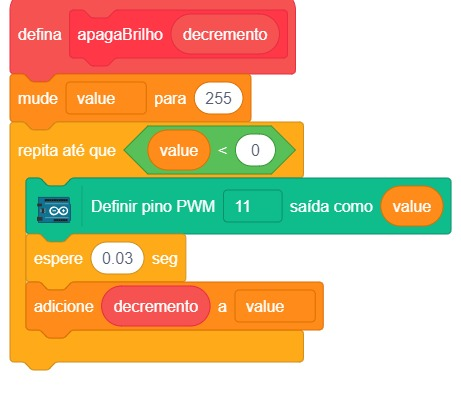

# Brilho Oscilante

  

Nos projetos anteriores vimos como ligar e desligar o nosso LED. Mas e se quiséssemos variar o brilho dessa luz? Com diversos componentes às vezes queremos variar a sua intensidade, e não apenas ligar ou desligar. Um motor, por exemplo, podemos querer variar a sua velocidade. Para isso usaremos uma função diferente do Arduino, a sua saída analógica.

## Material Necessário

- 1x LED Vermelho5 mm
- 1x Resistor 220 ohm
- 1x Protoboard
- 2x Jumper macho-macho
- 1x Cabo USB
- 1x Placa Arduino Uno

## Montagem do circuito

Neste projeto continuaremos com o mesmo circuito dos projetos [Projeto Pisca Pisca](/Projeto1/README.md) e [SOS Luminoso](/Projeto2/README.md).

## Programação

### Para PictoBlox

A programação de blocos pode ser vista na figura a baixo.

### Para ArduinoIDE

O código para programação na interface ArdunoIDE pode ser encotnrado [aqui](ArduinoIDE/ArduinoIDE.cpp).

## Possíveis erros

Caso o projeto não funcione verifique alguns dos possíveis erros:

- Verifique se os jumpers estão na mesma coluna dos terminais dos componentes, fazendo assim a conexão;
- Verifique se os jumpers estão ligados nos pinos corretos no Arduino;
- Verifique se o LED não está conectado invertido, ou seja, terminal negativo no pino 11 e positivo no pino GND;
- Verifique se o código carregou na placa através do PictoBlox ou do ArduinoIDE.

## Desafios

Veja abaixo alguns desafios que você pode tentar!

- Troque o LED por outro de cor diferente;
- Monte o circuito de uma maneira alternativa usando outros furos e posições na protoboard;
- Mude o intervalo de tempo que o LED pisca mudando o valor na programação na linha `delay(30);` por exemplo: `delay(350);` se estiver usando o ArduinoIDE ou altere os blocos `espere (0.03) seg` para `espere (o.350) seg` se estiver usando o PictoBlox.
