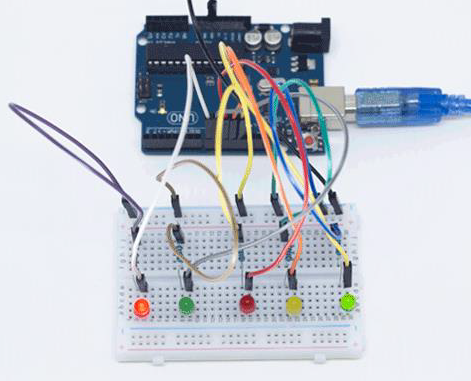
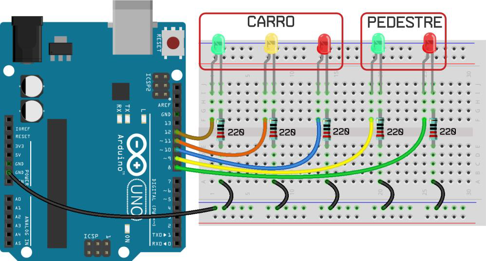
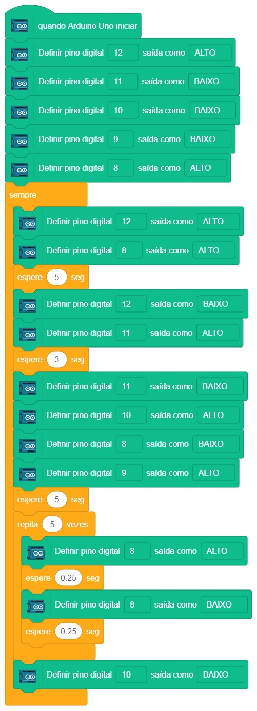

# Semáforo

  

Já está sabendo tudo de LEDs e como ligá-los? Então vamos montar esse projeto maior para juntar várias coisas que aprendemos até agora.

Este projeto irá simular um semáforo de carros e pedestres. Serão três LEDs para os carros e dois para os pedestres. A sequência inicia com o LED verde dos carros aceso e vermelho para pedestres. O semáforo dos carros então passa para cor amarela indo para cor vermelha, juntamente com o LED verde de pedestres. O LED vermelho dos pedestres então pisca e a sequência volta ao início.

## Material Necessário

- 2x LED Vermelho 5mm
- 2x LED Verde 5mm
- 1x LED Amarelo 5mm
- 5x Resistor 220 ohm
- 1x Protoboard
- 11x Jumper macho-macho
- 1x Cabo USB
- 1x Placa Arduino Uno

## Montagem do circuito

O grande desafio deste projeto está em montar os LEDs corretamente, pois o circuito consiste de mais LEDs, mais resistores e mais jumpers. Agora faremos uso de uma das linhas inferiores da protoboard, conectando o pino GND (negativo) do Arduino na linha azul da protoboard.

A maioria das pessoas, mesmo makers experientes, tem que voltar para esta parte do projeto e refazer, não se preocupe. Se você conseguir fazer a montagem funcionar na primeira tentativa, parabéns!

## Programação

### Para PictoBlox

A programação de blocos pode ser vista na figura a baixo.

### Para ArduinoIDE

O código para programação na interface ArdunoIDE pode ser encontrado [aqui](ArduinoIDE/ArduinoIDE.cpp).

## Possíveis erros

Caso o projeto não funcione verifique alguns dos possíveis erros:

- Verifique se os jumpers estão na mesma coluna dos terminais dos componentes, fazendo assim a conexão;
- Verifique se os jumpers estão ligados nos pinos corretos no Arduino;
- Verifique se o LED não está conectado invertido;
- Verifique se o código carregou na placa através do PictoBlox ou do ArduinoIDE.

## Formulário da Turma 602

[Clique aqui](https://forms.gle/EvUaxhfVKqX5SwA18)

## Desafios

Veja abaixo alguns desafios que você pode tentar!

- Monte o circuito de uma maneira alternativa usando outros furos e posições na protoboard;
- Mude o tempo que o LED amarelo dos veículos permanece aceso mudando o valor na programação na linha `delay(3000);` para `delay(6000);` se estiver usando o ArduinoIDE ou altere os blocos `espere (3) seg` para `espere (6) seg` se estiver usando o PictoBlox.
