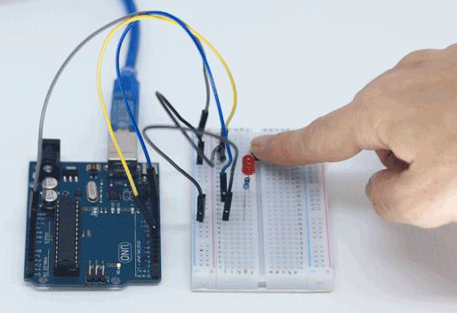
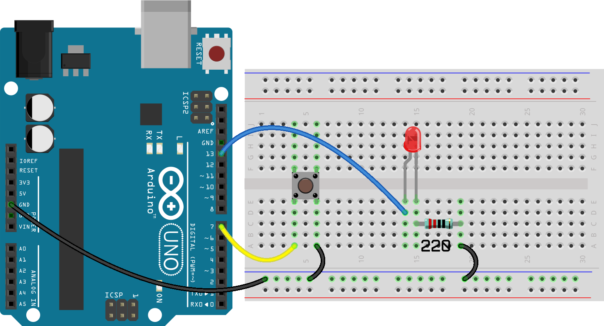
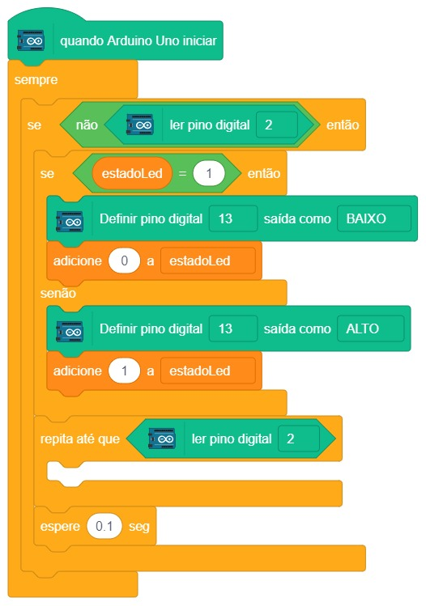

# Interruptor de luz

  

Neste projeto, veremos que também é possível acionar dispositivos através de interação humana. Agora alguns pinos serão porta de entrada, e não só saída como eram os projetos até aqui.

## Material Necessário

- 1x LED Vermelho 5mm
- 1x Resistor 220 ohm
- 1x Chave Táctil Push-button
- 1x Protoboard 400 pontos
- 5x Jumper Macho-macho
- 1x Cabo USB
- 1x Placa Arduino Uno

## Montagem do circuito

A chave táctil push button deve ser montada com dois terminais acima da cavidade central da protoboard e os outros dois abaixo. Um terminal da chave vai no pino 7 e outro no GND. No caso deste projeto o pino do LED é uma saída digital e o pino da chave é uma entrada digital.

## Programação

### Para PictoBlox

A programação de blocos pode ser vista na figura a baixo.

### Para ArduinoIDE

O código para programação na interface ArdunoIDE pode ser encontrado [aqui](ArduinoIDE/ArduinoIDE.cpp).

## Possíveis erros

Caso o projeto não funcione verifique alguns dos possíveis erros:

- Verifique se os jumpers estão na mesma coluna dos terminais dos componentes, fazendo assim a conexão;
- Verifique se os jumpers estão ligados nos pinos corretos no Arduino;
- Verifique se o LED não está conectado invertido;
- Verifique se os pinos do botão estão bem inseridos na protoboard;
- Verifique se o código carregou na placa através do PictoBlox ou do ArduinoIDE.

## Desafios

Veja abaixo alguns desafios que você pode tentar!

- Monte o circuito de uma maneira alternativa usando outros furos e posições na protoboard;
- Adicione mais uma chave táctil push button e modifique a programação para ligar o LED com uma chave e desligar com a outra.
